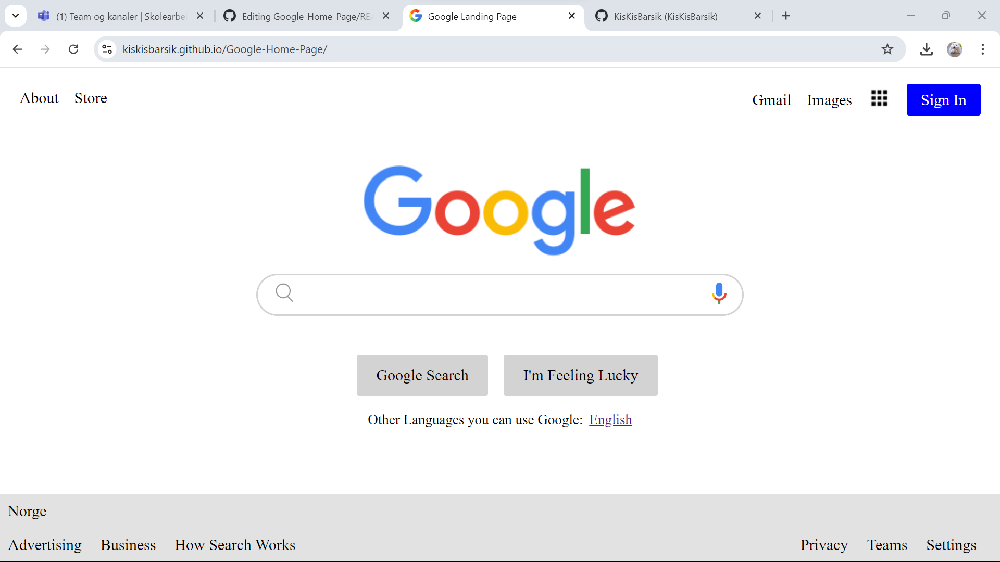

<h1 align="center">Google Landing Page</h1>
<div align="center">
  <h3>
    <a href="https://kiskisbarsik.github.io/Google-Home-Page/">
      Lenken til prosjektet
    </a>
  </h3>
</div>
<!-- TABLE OF CONTENTS -->

## Table of Contents

- [Overview](#overview)
- [Built With](#built-with)
- [Features](#features)
- [How to use](#how-to-use)
- [Contact](#contact)

<!-- OVERVIEW -->
## Overview
Den prosjekten er bare en oppgave, derfor det er ikke så mye ting. Men den prosjekten har knappene (som funker ikke) og input hvor du kan skrive text (som står for ingenting)

### Built With
- [HTML](https://www.w3schools.com/html/)
- [CSS](https://www.w3schools.com/css/default.asp)

## Features
<p>Search bar</p>
<p>Buttons in the navbar</p>
<p>Buttons in the search bar</p>
<p>Buttons in the footer</p>
<p>Apps button</p>

## How To Use

Det er faktisk bare nettside med knappene som funker ikke, så det har ikke fult funksjonalitet

Jeg har brukt sone type av coder:

```
HTML

I HTML koden jeg har brukt: header, div, a, img, section, input, p, footer, body og html elementene.

Så med andre ord det er bare skeleten (struktur)

CSS

I CSS koden jag har brukt: margin, padding, font-size, text-decoration, color, display, justify-content, align-items, margin-top, margin-left, margin-right, margin-bottom, background-color, border-radius, height, border, width, padding-top, padding-bottom, outline-style, text-align, position, bottom og border-bottom elementene.

Her er lenkene som kunne hjelpe:

- https://css-tricks.com/snippets/css/a-guide-to-flexbox/
- https://css-tricks.com/snippets/css/a-guide-to-flexbox/
- https://css-tricks.com/snippets/css/a-guide-to-flexbox/

```

## Contact
- GitHub [KisKisBarsik](https://github.com/KisKisBarsik)
- Epost [sadisintick@gmail.com](https://mail.google.com/mail/u/0/#inbox?compose=CllgCJfttkxnRTfZMLRPRccmtnVQKvxJczrlJJcfkTCSTvBlGjTSkHwXFpzLDXVWvnlPCkDHnvB)


## Forventet resultat



## Happy coding and thanks for your attention!
